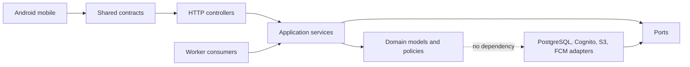
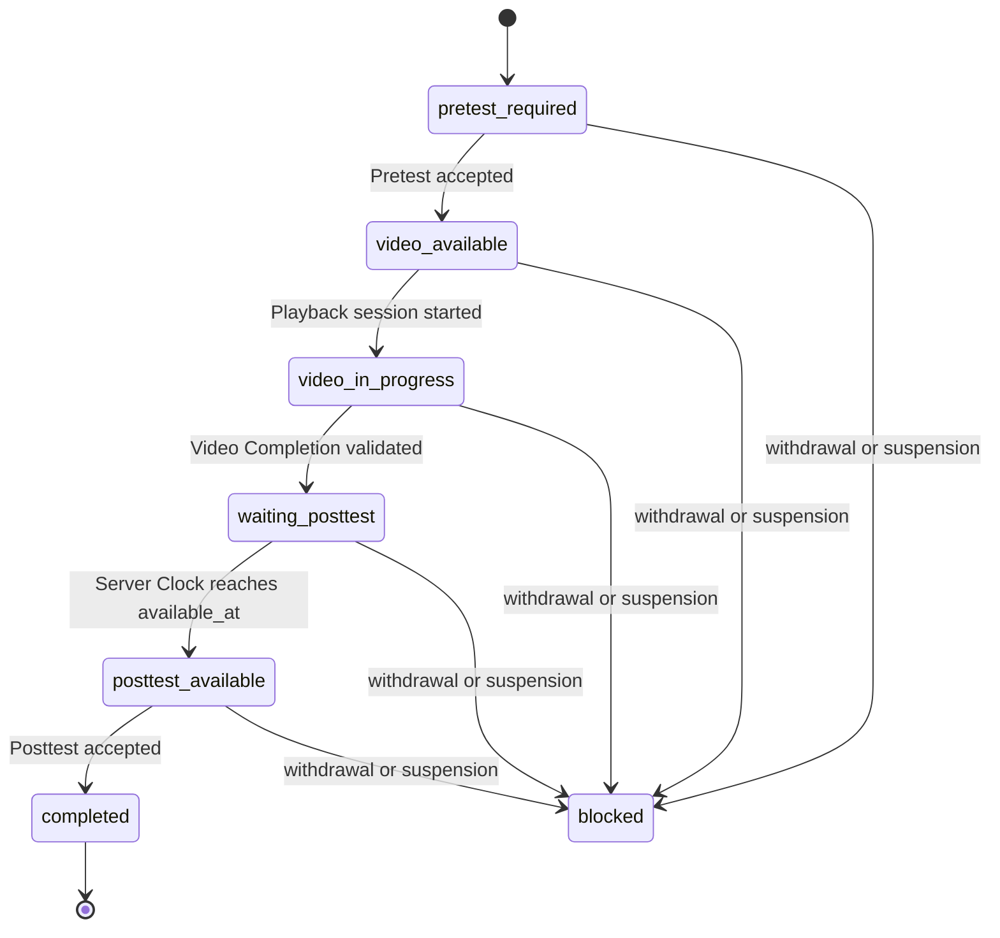
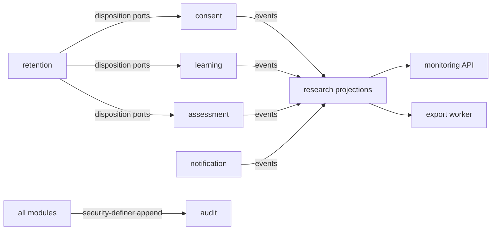
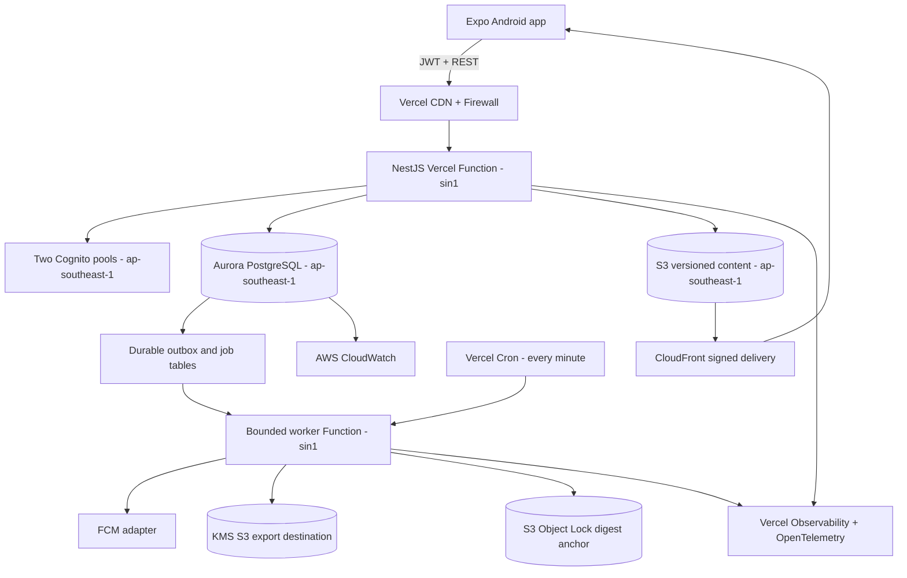
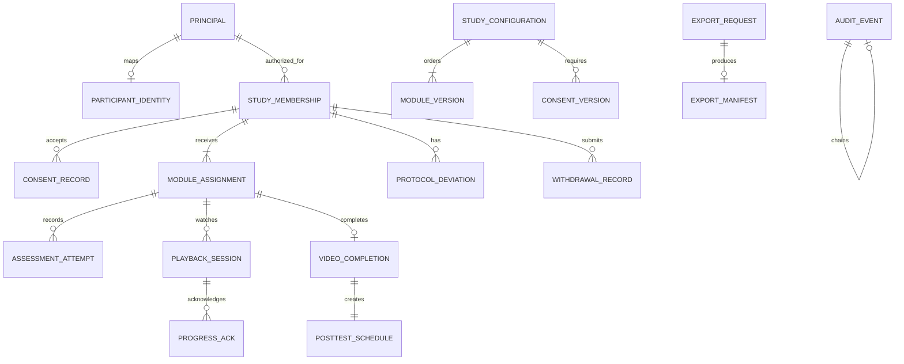

# Architecture Spine — SiAGA Bunda

## Design Paradigm

Modular monolith with hexagonal modules and a transactional outbox. Domain code depends inward; adapters depend on application ports; delivery and infrastructure never enter the domain.



Backend modules: `identity`, `consent`, `study-config`, `learning`, `assessment`, `notification`, `research`, `export`, `retention`, and `audit`. A module owns its domain, application services, ports, adapters, and tables. Cross-module behavior uses application commands or committed outbox events; no module writes another module’s tables.

## Invariants & Rules

### AD-1 — One modular backend, two Vercel projects

- **Binds:** all backend capabilities
- **Prevents:** independently invented services, circular dependencies, and duplicated business rules
- **Rule:** `apps/api` and `apps/worker` are separate Vercel projects and function entrypoints built from one modular codebase. Modules expose application ports only; direct cross-module repository or table access is forbidden by lint, imports, and database roles. Service extraction requires a new architecture decision after measured need.

### AD-2 — One versioned contract source

- **Binds:** all mobile/API interactions, FR-1..FR-36
- **Prevents:** incompatible DTOs, error shapes, enums, and timestamps
- **Rule:** `packages/contracts` defines Zod schemas, Learning State enums, RFC 9457 errors, pagination, and event envelopes. NestJS validates them and emits OpenAPI 3.1; mobile imports the same package. No endpoint-local duplicate request/response type is permitted.

### AD-3 — Backend and database time own Learning State

- **Binds:** FR-7..FR-10, FR-18..FR-22, NFR-9, NFR-14
- **Prevents:** device-clock unlocks, client-only completion, and divergent state transitions
- **Rule:** PostgreSQL `transaction_timestamp()` is the authoritative time inside mutations. Every Learning State transition runs through one domain state machine and one locked `participant_module` row. Clients submit observations and desired commands; only committed backend state authorizes access.



### AD-4 — Critical mutations are idempotent and serialized

- **Binds:** assessment submission, progress, completion, scheduling, withdrawal, exports, corrections
- **Prevents:** duplicate Source Records, double schedules, lost updates, and retry ambiguity
- **Rule:** Every mobile mutation carries a UUIDv7 `Idempotency-Key`. Store principal, operation, key, request hash, status, and response under a unique constraint; the same hash replays the response and a conflicting hash returns 409. Critical transitions lock their aggregate row and rely on unique database constraints as the final guard.

### AD-5 — Source Records never mutate

- **Binds:** Consent, answers, scores, progress acknowledgements, Video Completion, withdrawal, corrections
- **Prevents:** silent research-data rewriting and irreproducible exports
- **Rule:** Source Record tables permit insert and read only to application roles. Corrections append a linked record with actor, reason, approval, and prior record identifier. Database triggers reject update/delete; read models derive the effective view without hiding history.

### AD-6 — Authentication pools and authorization are separate

- **Binds:** FR-6, FR-23, FR-32, NFR-6, NFR-8
- **Prevents:** Researcher MFA weakening, Participant role escalation, and AWS credentials on devices
- **Rule:** Use two Amazon Cognito user pools in AWS `ap-southeast-1`: Participant uses SMS OTP; Researcher uses email/password with required TOTP. Access tokens live at most five minutes. The API validates issuer, audience, signature, expiry, and pool, then checks local device grant, session version, Study membership, and role on every request so logout, loss, withdrawal, and role revocation take effect without waiting for JWT expiry. No Cognito Identity Pool or direct AWS resource credentials are exposed to mobile. Participant Cognito sign-up begins only after Consent acceptance; unconfirmed enrollments expire and are purged by policy.

### AD-7 — Re-identification is an audited capability

- **Binds:** FR-4, FR-6, FR-25..FR-30, NFR-7
- **Prevents:** identifier spread through research queries, logs, exports, and caches
- **Rule:** Direct contact/profile data lives in an `identity` schema under a distinct database role; Study activity uses Participant Code and pseudonymous identifier. Only the identity module may join them. Re-identification requires an allowed role, a TOTP-authenticated token not older than five minutes, a reason code, and a successful audit append.

### AD-8 — Video exposure is session-validated

- **Binds:** FR-15..FR-18, NFR-9
- **Prevents:** forward-seek forgery, checkpoint inflation, device-clock manipulation, and duplicate completion
- **Rule:** The learning module issues a short-lived playback session bound to Participant, Module assignment, Video version, and signed CloudFront URL. Mobile sends sequenced checkpoints every 10 seconds. The backend accepts only contiguous movement bounded by prior acknowledgement, Server Clock elapsed time plus two seconds, and a maximum 15-second delta. Rewind is allowed but never increases coverage. Completion requires contiguous validated coverage to within one second of the canonical duration and total validated elapsed time to within two seconds; these tolerances cover encoding precision only and never authorize a skipped interval.

### AD-9 — Posttest availability is computed, not delivered

- **Binds:** FR-19..FR-22
- **Prevents:** notification-driven unlocks, missed-job lockout, and timezone drift
- **Rule:** The Video Completion transaction inserts one schedule with `available_at = transaction_timestamp() + interval '168 hours'`. Fetch and submit authorize from `available_at` on every request. Notifications may be late or absent without changing access; UI localizes the stored instant for display only.

### AD-10 — Async side effects use a durable database queue

- **Binds:** notifications, exports, retention, digest anchoring, operational events
- **Prevents:** dual writes, dropped side effects, reliance on a long-lived worker, and competing job semantics
- **Rule:** A domain mutation and its outbox/job row commit in one PostgreSQL transaction. Vercel Cron invokes `apps/worker` every minute; each invocation claims a bounded batch with `FOR UPDATE SKIP LOCKED`, checkpoints chunked work, and records idempotent delivery by event identifier plus handler name. Failures remain durably due for a later invocation with bounded backoff; poison jobs move to a database `failed_job` table that alerts and supports audited replay. Vercel Cron provides the trigger, not durability or retry. No asynchronous job owns Learning State.

### AD-11 — Notifications reveal no Study context

- **Binds:** FR-21, FR-22, NFR-7
- **Prevents:** pregnancy or Study disclosure on shared devices and token reassignment leakage
- **Rule:** The notification module sends only approved neutral templates through an FCM adapter. Tokens bind to one principal/device installation, rotate on sign-in, and revoke on logout, withdrawal, reassignment, or provider invalidation. Payloads contain an opaque route nonce; app open reauthenticates and fetches current backend state.

### AD-12 — Exports never become mobile files

- **Binds:** FR-27, FR-30, NFR-7, NFR-8
- **Prevents:** unrestricted share sheets, stale authorization, and identifier leakage
- **Rule:** Mobile submits an approved template, purpose, and configured destination after Researcher step-up. A worker waits for the research projection to reach the request’s outbox watermark, creates a repeatable-read snapshot under the requesting authorization, writes a KMS-encrypted object to the Study-controlled S3 destination, and records watermark/manifest/hash/expiry. Mobile sees status and audit reference only; it receives no object bytes or presigned download URL.

### AD-13 — Study configuration is immutable after activation

- **Binds:** FR-1..FR-5, FR-11..FR-14, FR-31, FR-33, FR-35, FR-36
- **Prevents:** participants receiving mixed Consent, content, questions, keys, timing, or safety guidance
- **Rule:** Configuration versions reference immutable versions of Consent, comprehension, fields, seven Modules, Videos, assessments, scoring keys, 168-hour Delay, late window, Urgent-care Guidance, support routes, retention, and export templates. Activation is atomic after configured approvals and consistency checks. An enrolled assignment retains its version until an explicit migration/re-consent decision.

### AD-14 — Mobile stores the minimum

- **Binds:** all Participant and Researcher mobile flows, NFR-7, NFR-14
- **Prevents:** sensitive cache leakage, stale offline authority, and role-data crossover
- **Rule:** TanStack Query cache is memory-only. SecureStore holds refresh credentials, installation identifier, and small assessment choice drafts scoped to account/configuration; registration and Consent drafts are memory-only. Logout, revocation, withdrawal acceptance, role change, or submitted assessment clears scoped state. No answer keys, direct export data, or privileged AWS credentials ship to or persist on mobile.

### AD-15 — Audit is independently tamper-evident

- **Binds:** FR-14, FR-25, FR-27..FR-31, NFR-10, NFR-13
- **Prevents:** application-level deletion, untraceable privileged access, and undetected history edits
- **Rule:** All required actions append through a `SECURITY DEFINER` database function callable by application roles but owned by a dedicated insert-only audit role; source mutation and audit append share one transaction where audit is mandatory. The function serializes a per-Study/day chain head and writes actor, action, target pseudonym, outcome, Server Clock, correlation identifier, reason, and previous digest; payloads exclude secrets and unnecessary identifiers. A worker anchors partition digests to KMS-signed S3 Object Lock objects, and verification runs on schedule and during export/audit review.

### AD-16 — Retention is policy-executed, not manual

- **Binds:** FR-28, FR-29, FR-34, NFR-7, NFR-13
- **Prevents:** forgotten copies, ad hoc deletion, and false anonymization
- **Rule:** A versioned retention policy defines trigger, period, action, exception authority, and vendor/backup treatment per data class. The retention module orchestrates through each owning module’s disposition port and never writes foreign tables. Jobs run dry first, require dual approval for production execution, and append disposition evidence. Production Study activation fails when any collected class lacks a complete rule.

### AD-17 — Singapore is the explicit Vercel/AWS operational boundary

- **Binds:** NFR-1, NFR-2, NFR-6, NFR-7, NFR-10, NFR-12
- **Prevents:** Vercel defaulting to the US, environment drift, public database exposure, unapproved regions, and shared production access
- **Rule:** `apps/api` and `apps/worker` deploy as separate Vercel projects on Fluid Compute in `sin1`; Vercel Pro is the minimum production plan. Development, Preview, and Production use separate Vercel environments and separate AWS accounts/resources. AWS `ap-southeast-1` hosts Aurora PostgreSQL Serverless v2, Cognito, S3/CloudFront, KMS, Secrets Manager, and CloudWatch. Connect through Vercel's AWS Marketplace integration with OIDC Federation and RDS IAM; production must use Pro Static IP allowlisting at minimum, or Enterprise Secure Compute when private VPC connectivity is required by privacy policy. Preview uses synthetic data unless separately approved. Because Vercel has no Jakarta compute region, storing and processing Study Data in Singapore is a documented cross-border transfer and a hard Study Owner/privacy launch gate; SMS and FCM remain additional documented vendor transfers.

### AD-18 — Delivery is migration-first and rollback-safe

- **Binds:** all deployable units and NFR-1..NFR-15
- **Prevents:** incompatible app/API releases, destructive schema rollback, and unreviewed behavior updates
- **Rule:** CI builds from a frozen pnpm lockfile, verifies contracts and migrations, runs additive migrations as a promotion gate outside the Vercel build, then promotes backward-compatible API and worker deployments from tested Vercel Preview artifacts. Production rollback uses the prior Vercel deployment and never depends on reversing a schema migration. Android releases use signed EAS production builds and Google Play tracks; production EAS Update is disabled. Destructive migration requires a later cleanup release after old clients and code paths are retired.

### AD-19 — Observability is redacted and correlation-first

- **Binds:** NFR-10, incident response, support
- **Prevents:** PII in telemetry and untraceable cross-process failures
- **Rule:** Generate one correlation identifier at ingress and propagate it through logs, OpenTelemetry traces, outbox/jobs, audit, and user-safe support codes. Vercel Observability covers function delivery and AWS CloudWatch covers managed data services. Structured logs allow only classified fields; request bodies, answers, phone numbers, tokens, and direct identifiers are denied. Alerts cover invariant rejection spikes, cron absence, oldest-due-job age, `failed_job` count, scheduling failure, export failure, audit verification, auth abuse, and backup health.

### AD-20 — Invariants are tested below the UI

- **Binds:** SM-1..SM-6, NFR-15, readiness and release gates
- **Prevents:** UI-only confidence and untested race/time boundaries
- **Rule:** Domain tests exhaust every state transition; integration tests use real PostgreSQL and concurrency; API tests exercise auth, idempotency, clock boundaries, duplicate submissions, and authorization; Maestro covers final Android flows. CI blocks on contract drift, migration failure, invariant failure, security scan critical/high findings, or missing FR-to-test mapping.

### AD-21 — Research reads one event-built projection

- **Binds:** FR-24..FR-27, reporting, monitoring, export
- **Prevents:** ad hoc joins across module tables, incompatible metric definitions, and partial export snapshots
- **Rule:** Owning modules emit versioned committed events; the research module builds pseudonymous projection tables and owns every aggregate, denominator, timeline, deviation view, and export read model. Projection handlers are idempotent and ordered per aggregate, expose an outbox watermark, and can rebuild from Source Records plus events. Operational UI labels projection freshness; exports wait for their captured watermark before snapshotting.



### AD-22 — Edge and identity abuse controls are layered

- **Binds:** authentication, enrollment, playback, assessment, export, support-facing APIs
- **Prevents:** OTP bombing, credential stuffing, enumeration, scraping, replay, and denial-of-service bypass
- **Rule:** Vercel Firewall enforces edge IP/device rate classes; Cognito enforces sign-in throttling and generic responses; the API enforces per-principal and per-Study quotas with stricter limits for OTP, recovery, playback-session creation, submission, re-identification, and export. Limits return RFC 9457 responses with retry metadata, never reveal enrollment, and create redacted security events. Cron/job endpoints validate Vercel's `CRON_SECRET` bearer token and application-level workload authorization; health endpoints reveal no dependencies or Study data.

### AD-23 — Cryptographic purposes do not share keys

- **Binds:** NFR-2, NFR-6, NFR-7, NFR-12, stored Study Data and credentials
- **Prevents:** one key compromise exposing every data class and untracked secret reuse
- **Rule:** TLS 1.2 or newer protects transport. Aurora PostgreSQL, content S3, export S3, audit anchors, logs, and backups use distinct KMS keys with least-privilege grants; export objects additionally carry manifest hashes. Secrets Manager owns provider secrets; OIDC/RDS IAM supplies short-lived database access; Cognito owns credentials; application configuration contains no secret values. Key disable/rotation is rehearsed, audited, and included in incident runbooks.

### AD-24 — Vercel deployability is a tested invariant

- **Binds:** all backend deployables and the first infrastructure epic
- **Prevents:** container-only assumptions, unbounded functions, local-filesystem durability, accidental US deployment, and production data exposure in Preview
- **Rule:** The monorepo defines independent Vercel projects rooted at `apps/api` and `apps/worker`; configuration pins `sin1`, Fluid Compute, Node.js 24.x, and explicit environment bindings. API bundles remain below 250 MB, request/response bodies remain below 4.5 MB, `/tmp` is ephemeral only, and worker jobs checkpoint within configured function duration. Before feature implementation proceeds, a Vercel Preview proof must deploy both projects and verify `/health`, one synthetic serializable Aurora transaction, one cron-triggered outbox drain, redacted observability, environment isolation, and rollback to a prior deployment.

## Consistency Conventions

| Concern | Convention |
| --- | --- |
| Names | TypeScript `camelCase`/`PascalCase`; PostgreSQL `snake_case`; modules and events use glossary nouns; events are past-tense `module.entity.action.v1`. |
| Identifiers | Server application boundary generates UUIDv7 with `uuid` 13.0.2; Participant Code is a separate non-sequential, non-meaningful display identifier. |
| Time | Store `timestamptz` UTC; RFC 3339 JSON with `Z`; display localized instant plus zone; durations are integer milliseconds. |
| Money/score | Scores store integer correct/total plus scoring-key version; never floating-point source values. |
| HTTP | `/api/v1`; JSON; cursor pagination; RFC 9457 errors with stable `type`, `code`, `correlationId`, and field issues. |
| Mutation | UUIDv7 `Idempotency-Key`; request hash conflict is 409; optimistic client state never implies backend acceptance. |
| Database | One schema per owner module; foreign identifiers may be referenced but never mutated across module roles; migrations are forward-only. |
| Config | Environment variables name non-secret config; Secrets Manager supplies secrets; startup validates a typed configuration schema and fails closed. |
| Authorization | Deny by default; controller policy plus application authorization; sensitive reads require purpose/reason and audit. |
| Logging | Structured JSON, correlation-first, allowlisted fields, no bodies or health/identity values. |
| Events | Outbox envelope includes UUIDv7 id, type, aggregate, version, occurredAt, correlationId, and schemaVersion. |
| Testing | Synthetic fixtures only outside approved production; deterministic injected clock in domain and real database time in integration tests. |

## Stack

| Name | Version |
| --- | --- |
| Node.js | 24.18.0 LTS |
| TypeScript | 5.9.x |
| pnpm | 11.1.1 |
| Turborepo | 2.9.15 |
| Expo SDK | 56.0.0 |
| React Native | 0.85.x |
| React | 19.2.3 |
| Android compile/target SDK | API 36 |
| NestJS | 11.1.24 |
| Zod | 4.x |
| Prisma ORM | 7.7.0 |
| Aurora PostgreSQL | 17.9.2-compatible |
| uuid | 13.0.2 |
| Vercel CLI | >=48.4.0 <49 |
| Vercel runtime | Node.js 24.x, Fluid Compute |
| AWS SDK for JavaScript | 3.1055.0 |
| AWS CDK | 2.257.0 |
| Maestro CLI | 2.4.0 |
| AWS platform services | managed service APIs available 2026-07-01 |

## Structural Seed

```text
siaga-bunda/
  apps/
    mobile/                 # Expo Android app; Participant and Researcher route groups
    api/                    # NestJS Vercel project and HTTP composition root
    worker/                 # Bounded Vercel Cron/job project and composition root
  packages/
    contracts/              # Zod schemas, enums, errors, OpenAPI generation
    domain/                 # Shared value objects only; no module business ownership
    db/                     # Prisma clients, forward migrations, database roles/triggers
    config/                 # Typed configuration and environment contracts
    ui/                     # DESIGN tokens and shared mobile primitives
    testing/                # Synthetic fixtures, clocks, contract and integration harness
  modules/
    identity/
    consent/
    study-config/
    learning/
    assessment/
    notification/
    research/
    export/
    retention/
    audit/
  infrastructure/          # AWS CDK stacks and Vercel project/environment configuration
  e2e/                     # Maestro flows and backend fixture controls
```





Environment flow: local uses Docker PostgreSQL, `vercel dev`, and explicit fake adapters. Vercel Preview uses isolated synthetic staging resources; Production uses separately approved AWS resources in Singapore. No production data is copied into Preview or local environments. Aurora automated backups and point-in-time recovery are encrypted and restore-tested; retention/disposition policy governs their expiry.

## Capability → Architecture Map

| Capability / Area | Lives in | Governed by |
| --- | --- | --- |
| Enrollment and identity | mobile, identity, consent | AD-2, AD-6, AD-7, AD-13, AD-14 |
| Learning State and Dashboard | learning | AD-3, AD-4, AD-9 |
| Assessments and scoring | assessment | AD-2, AD-4, AD-5, AD-13 |
| Controlled Video | mobile, learning, S3/CloudFront | AD-3, AD-8, AD-14 |
| Delay and reminders | learning, notification, worker | AD-9, AD-10, AD-11 |
| Researcher monitoring | research, identity | AD-6, AD-7, AD-15 |
| Controlled export | export, worker | AD-4, AD-7, AD-10, AD-12, AD-15 |
| Withdrawal and data rights | consent, retention | AD-4, AD-5, AD-16 |
| Study/content publication | study-config | AD-5, AD-13, AD-15 |
| Research projections | research | AD-10, AD-21 |
| Audit and operations | audit, worker, infrastructure | AD-10, AD-15, AD-17, AD-19, AD-23 |
| Deployment and release | infrastructure, CI | AD-17, AD-18, AD-20, AD-22, AD-23, AD-24 |

## Deferred

- SMS origination identity, sender registration, FCM project, and exact vendor contracts wait for privacy/procurement approval; adapters and failure semantics are fixed by AD-6 and AD-11.
- Exact Study retention periods, late Posttest window, enrollment rules, and urgent-care content wait for approved Study artifacts; configuration completeness and activation behavior are fixed by AD-13 and AD-16.
- Vercel Fluid Compute memory/concurrency/duration settings and Aurora capacity units wait for load evidence; NFR latency, availability, RTO/RPO, alarms, and Multi-AZ durability already bind operations.
- Vercel has no Jakarta compute region. If policy later requires Indonesia-only processing, the primary backend must move to approved Indonesia compute or adopt a separately reviewed cross-region design; this cannot be solved by Vercel configuration.
- iOS, multi-Study tenancy, desktop Researcher UI, offline completion, and service extraction are outside MVP scope and require upstream product changes before architecture work.
