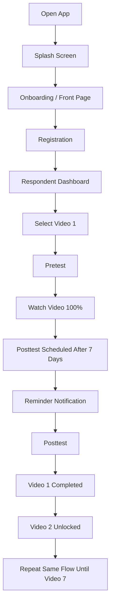
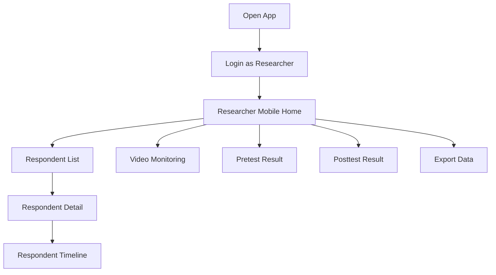
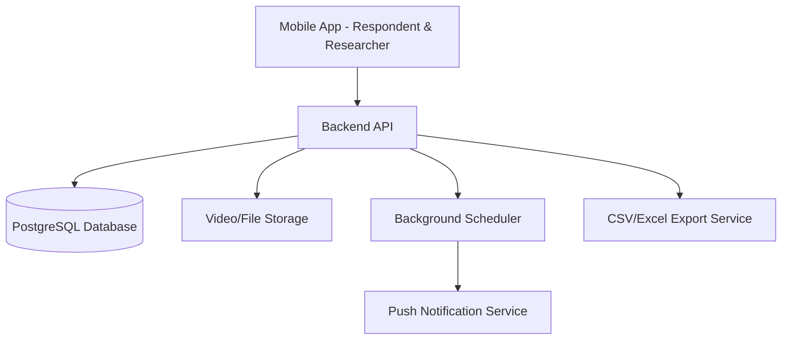

# SiAGA Bunda Application Blueprint

## BMAD-Ready Product Blueprint for Real Project Development

---

# 1. Project Overview

## Project Name

**SiAGA Bunda**

## Product Type

Mobile application for pregnant mothers and mobile researcher monitoring.

## Core Tagline

**Kenali Tanda Bahaya, Lindungi Ibu dan Bayi**

## Main Purpose

SiAGA Bunda is an educational and research-support mobile application designed to help pregnant mothers understand pregnancy danger signs through structured video learning. The application also ensures research validity by forcing a controlled learning flow: registration, pretest, full video watching, automatic posttest scheduling after 7 days, posttest completion, and locked progression to the next video.

---

# 2. BMAD Project Direction

This blueprint can be used as the foundation for the following BMAD workflow:

1. **Analyst**

   * Refine problem, user personas, domain context, and project brief.

2. **Product Manager**

   * Convert this blueprint into PRD, epics, user stories, acceptance criteria, and release plan.

3. **UX Designer**

   * Convert the storyboard and flow into Figma wireframes and mobile UI design.

4. **Architect**

   * Convert requirements into system architecture, data model, API design, notification flow, and deployment structure.

5. **Scrum Master**

   * Break epics into implementation-ready stories.

6. **Developer**

   * Build the mobile app, backend, database, admin/researcher flow, and testing.

7. **QA**

   * Validate feature behavior, research flow correctness, lock/unlock logic, video tracking, scoring, and notification timing.

---

# 3. Product Vision

To provide a simple, guided, and research-compliant mobile education platform for pregnant mothers, where every participant follows the same learning sequence and researchers can monitor respondent progress accurately.

---

# 4. Target Users

## 4.1 Pregnant Mother / Respondent

Primary user who will:

* Register personal and pregnancy data.
* Complete pretest before each video.
* Watch educational video until 100%.
* Wait 7 days for posttest.
* Complete posttest.
* Continue to the next unlocked video.

## 4.2 Researcher / Admin

Research user who will:

* Monitor respondents.
* View video completion progress.
* View pretest results.
* View posttest results.
* Check respondent detail.
* Export research data.

Important design decision:

The researcher interface should also be mobile-first, not a desktop-style dashboard.

---

# 5. Core Problem

Pregnant mothers may not fully understand pregnancy danger signs, and researchers need a controlled system to ensure each respondent follows the same educational process.

The application must prevent invalid research flow by ensuring:

* Pretest is completed before video.
* Video cannot be skipped.
* Video must be watched 100%.
* Posttest is only available 7 days after video completion.
* Next video is locked until the previous posttest is completed.

---

# 6. MVP Scope

## 6.1 In Scope for MVP

### Respondent Side

* Splash screen.
* Onboarding/front page.
* Pregnant mother registration.
* Auto calculation for HPL and pregnancy age from HPHT.
* Respondent dashboard.
* Video list from Video 1 to Video 7.
* Pretest flow.
* Video player with no-skip behavior.
* Watch duration tracking.
* Video completion tracking.
* Automatic posttest schedule after 7 days.
* Reminder notification.
* Posttest flow.
* Score calculation.
* Video locking and unlocking.
* Respondent profile.

### Researcher Side

* Researcher login.
* Mobile researcher home.
* Respondent list.
* Respondent detail.
* Video monitoring.
* Pretest result summary.
* Posttest result summary.
* Export data request screen.

### Backend

* Authentication.
* Respondent data storage.
* Pretest and posttest answer storage.
* Score calculation.
* Video watch history.
* Video progress tracking.
* Posttest schedule generation.
* Notification scheduler.
* Researcher monitoring API.
* Export data API.

---

## 6.2 Out of Scope for MVP

These can be added later:

* Chat consultation.
* Telemedicine.
* Payment.
* Article library.
* Multi-language content.
* Community forum.
* AI medical assistant.
* Offline-first video download.
* Complex role permission management.
* Desktop web dashboard.

---

# 7. Key Product Rules

## Rule 1 — Pretest Before Video

A respondent cannot watch a video before completing the pretest for that video.

## Rule 2 — Video Cannot Be Skipped

The video player should not allow forward skipping.

Allowed:

* Pause.
* Resume.
* Replay watched section.

Not allowed:

* Jump forward.
* Mark video complete manually.
* Open next screen before 100% completion.

## Rule 3 — Watch Progress Must Be Recorded

The system must record:

* Video ID.
* Respondent ID.
* Watch start time.
* Watch end time.
* Watch duration.
* Completion percentage.
* Completion timestamp.

## Rule 4 — Posttest Available After 7 Days

After video completion, the system creates a posttest schedule exactly 7 days later.

## Rule 5 — Next Video Locked Until Posttest Completed

Example:

* Video 2 is locked until Posttest Video 1 is completed.
* Video 3 is locked until Posttest Video 2 is completed.
* This continues until Video 7.

## Rule 6 — Researcher Can Monitor but Not Manipulate Core Result

Researcher can view and export data, but should not manually change pretest/posttest scores unless a special correction feature is added later.

---

# 8. Main User Flow

## 8.1 Respondent Flow



## 8.2 Researcher Flow



---

# 9. Screen Blueprint

## 9.1 Respondent Mobile Screens

### Screen 1 — Splash Screen

Purpose:

Introduce the application.

Main elements:

* Logo SiAGA Bunda.
* Tagline.
* Soft maternal health illustration.
* Auto redirect to onboarding.

---

### Screen 2 — Onboarding / Front Page

Purpose:

Explain what the app does.

Main elements:

* App logo.
* Tagline.
* Short description.
* Primary button: **Mulai Sekarang**
* Secondary link: **Masuk sebagai Peneliti**

Primary action:

* Tap **Mulai Sekarang** to registration.

---

### Screen 3 — Registration Step 1: Identity Data

Fields:

* Name.
* Age.
* Phone number.
* Address.
* Education.
* Occupation.

Action:

* Tap **Lanjutkan**.

Validation:

* Required fields must be filled.
* Phone number must be valid.

---

### Screen 4 — Registration Step 2: Pregnancy Data

Fields:

* HPHT.
* HPL automatic.
* Pregnancy age automatic.
* Number of children.
* Medical history.
* Birth history.

Action:

* Tap **Lanjutkan**.

System behavior:

* HPL and pregnancy age are calculated automatically after HPHT is selected.

---

### Screen 5 — Registration Step 3: Supporting Data

Fields:

* Husband support.
* Medical history.
* Pregnancy complication history.
* Consent checkbox if needed.

Action:

* Tap **Simpan Data**.

System behavior:

* Save respondent data.
* Redirect to dashboard.

---

### Screen 6 — Respondent Dashboard

Purpose:

Show learning progress and next task.

Main elements:

* Greeting: “Selamat datang, Ibu [Name]”.
* Pregnancy age card.
* HPL card.
* Education progress percentage.
* Video 1–7 list.
* Status for each video.

Video statuses:

* Locked.
* Pretest required.
* Video available.
* Video in progress.
* Waiting posttest.
* Posttest available.
* Completed.

Primary action:

* Tap available video.

---

### Screen 7 — Locked Video Detail

Purpose:

Explain why a video is locked.

Main elements:

* Lock icon.
* Message:
  “Selesaikan posttest video sebelumnya untuk membuka video ini.”
* Button: **Kembali ke Dashboard**

---

### Screen 8 — Pretest Intro

Purpose:

Prepare user before pretest.

Main elements:

* Video title.
* Message:
  “Silakan mengisi pretest terlebih dahulu.”
* Total questions: 10.
* Button: **Mulai Pretest**

---

### Screen 9 — Pretest Question

Purpose:

Collect answers.

Main elements:

* Question number.
* Question text.
* Multiple choice answers.
* Previous button.
* Next button.
* Submit button on last question.

System behavior:

* Save answers.
* Calculate score after submit.
* Unlock video screen.

---

### Screen 10 — Pretest Completed

Purpose:

Confirm pretest submission.

Main elements:

* Success icon.
* Message:
  “Pretest berhasil disimpan.”
* Button: **Tonton Video**

---

### Screen 11 — Video Player

Purpose:

Make user watch the video until completion.

Main elements:

* Video title.
* Video player.
* Watch progress.
* Warning text:
  “Video harus ditonton sampai selesai dan tidak dapat di-skip.”
* Disabled finish button until 100%.

System behavior:

* Disable forward seeking.
* Track watch duration.
* Store timestamp.
* Enable finish button after 100%.

---

### Screen 12 — Video Completed

Purpose:

Inform user that posttest has been scheduled.

Main elements:

* Success icon.
* Message:
  “Sistem akan mengirimkan posttest pada 7 hari mendatang.”
* Posttest available date.
* Button: **Kembali ke Dashboard**

System behavior:

* Create posttest schedule.
* Set status to waiting_posttest.

---

### Screen 13 — Waiting Posttest Dashboard

Purpose:

Show waiting state.

Main elements:

* Video card status: “Menunggu Posttest”.
* Posttest date.
* Next video locked.
* Information banner.

---

### Screen 14 — Posttest Reminder

Purpose:

Notify user on day 7.

Main elements:

* Push notification:
  “Ibu, saatnya mengisi posttest Video 1.”
* Dashboard banner:
  “Posttest Video 1 sudah tersedia.”

Action:

* Tap notification or banner to open posttest.

---

### Screen 15 — Posttest Intro

Purpose:

Prepare user before posttest.

Main elements:

* Video title.
* Total questions: 10.
* Button: **Mulai Posttest**

---

### Screen 16 — Posttest Question

Purpose:

Collect posttest answers.

Main elements:

* Question number.
* Question text.
* Multiple choice options.
* Submit button on last question.

System behavior:

* Save answers.
* Calculate score.
* Mark video completed.
* Unlock next video.

---

### Screen 17 — Posttest Completed

Purpose:

Show result and next step.

Main elements:

* Success icon.
* Score.
* Message:
  “Video berikutnya sudah terbuka.”
* Button: **Lanjut ke Video Berikutnya**
* Secondary button: **Kembali ke Dashboard**

---

## 9.2 Researcher Mobile Screens

### Screen 1 — Researcher Login

Purpose:

Allow researcher access.

Main elements:

* Logo.
* Email or username.
* Password.
* Button: **Masuk**

Validation:

* Incorrect login shows error message.

---

### Screen 2 — Researcher Home

Purpose:

Show mobile summary.

Main elements:

* Total respondents.
* Active respondents.
* Completed all videos.
* Average education progress.
* Quick menu:

  * Responden.
  * Monitoring Video.
  * Hasil Pretest.
  * Hasil Posttest.
  * Export Data.

---

### Screen 3 — Respondent List

Purpose:

Show all respondents.

Main elements:

* Search input.
* Filter by status.
* Respondent cards.

Each card contains:

* Name.
* Pregnancy age.
* HPL.
* Current video status.
* Progress percentage.

Action:

* Tap respondent card to open detail.

---

### Screen 4 — Respondent Detail

Purpose:

Show individual respondent profile and learning progress.

Main sections:

* Identity data.
* Pregnancy data.
* Supporting data.
* Education progress.
* Timeline activity.

Timeline example:

* Pretest Video 1 completed.
* Video 1 watched.
* Posttest Video 1 scheduled.
* Posttest Video 1 completed.
* Video 2 unlocked.

---

### Screen 5 — Video Monitoring

Purpose:

Monitor completion per video.

Main elements:

* Video 1–7 cards.
* Each card shows:

  * Pretest completed count.
  * Video completed count.
  * Waiting posttest count.
  * Posttest completed count.

Action:

* Tap video card to see respondent list filtered by selected video.

---

### Screen 6 — Pretest Results

Purpose:

Show average pretest score.

Main elements:

* Average score per video.
* Total participants per video.
* Highest score.
* Lowest score.
* Simple bar chart or card list.

---

### Screen 7 — Posttest Results

Purpose:

Show average posttest score.

Main elements:

* Average score per video.
* Total participants per video.
* Highest score.
* Lowest score.
* Simple bar chart or card list.

---

### Screen 8 — Pretest vs Posttest Comparison

Purpose:

Show education impact.

Main elements:

* Video list.
* Average pretest score.
* Average posttest score.
* Score improvement.
* Percentage improvement.

---

### Screen 9 — Export Data

Purpose:

Allow researcher to export research data.

Main elements:

* Date range filter.
* Video filter.
* Respondent status filter.
* Export button.

Export format:

* Excel / CSV.

---

# 10. Functional Requirements

## FR-001: Respondent Registration

The system shall allow pregnant mothers to register their identity, pregnancy, and supporting data.

Acceptance criteria:

* User can fill all required fields.
* System validates required fields.
* HPL is calculated automatically from HPHT.
* Pregnancy age is calculated automatically from HPHT.
* User can save data successfully.
* User is redirected to dashboard after registration.

---

## FR-002: Respondent Dashboard

The system shall display the respondent’s learning progress.

Acceptance criteria:

* Dashboard shows user greeting.
* Dashboard shows pregnancy age.
* Dashboard shows HPL.
* Dashboard shows completion percentage.
* Dashboard shows Video 1 to Video 7.
* Each video has a clear status.

---

## FR-003: Pretest

The system shall require a pretest before each video.

Acceptance criteria:

* Video cannot be opened before pretest.
* Pretest contains 10 multiple choice questions.
* User can navigate between questions.
* User can submit answers.
* System calculates score automatically.
* Video becomes available after pretest submission.

---

## FR-004: Video Watching

The system shall require users to watch each video completely.

Acceptance criteria:

* Video cannot be skipped forward.
* User can pause and resume.
* System records watch start time.
* System records watch duration.
* System records video completion.
* Finish button only activates after 100% watch progress.

---

## FR-005: Posttest Scheduling

The system shall schedule posttest 7 days after video completion.

Acceptance criteria:

* Posttest is not available immediately after video.
* System creates posttest schedule after video completion.
* Dashboard shows posttest available date.
* User receives reminder when posttest is available.

---

## FR-006: Posttest

The system shall allow users to complete posttest after the waiting period.

Acceptance criteria:

* Posttest becomes available after 7 days.
* Posttest contains 10 questions.
* User can submit answers.
* System calculates score automatically.
* Video status becomes completed.
* Next video is unlocked.

---

## FR-007: Video Locking

The system shall lock the next video until the previous posttest is completed.

Acceptance criteria:

* Video 2 is locked until Posttest Video 1 is completed.
* Video 3 is locked until Posttest Video 2 is completed.
* Locked video shows explanation message.
* User cannot bypass locked video.

---

## FR-008: Researcher Login

The system shall allow researcher to access monitoring features.

Acceptance criteria:

* Researcher can log in with valid credentials.
* Invalid credentials show error.
* Researcher cannot access respondent-only flow after login.
* Respondent cannot access researcher flow.

---

## FR-009: Researcher Monitoring

The system shall allow researcher to monitor respondent progress.

Acceptance criteria:

* Researcher can see total respondents.
* Researcher can see respondent list.
* Researcher can view respondent detail.
* Researcher can see video completion count.
* Researcher can see pretest score summary.
* Researcher can see posttest score summary.

---

## FR-010: Export Data

The system shall allow researcher to export research data.

Acceptance criteria:

* Researcher can filter data.
* Researcher can export respondent data.
* Researcher can export pretest data.
* Researcher can export posttest data.
* Export file can be opened in spreadsheet application.

---

# 11. Non-Functional Requirements

## NFR-001: Usability

The app must be simple enough for pregnant mothers with different levels of digital literacy.

Requirements:

* Clear labels.
* Large buttons.
* Minimal visual clutter.
* Friendly language.
* Clear error messages.

## NFR-002: Data Privacy

The app stores sensitive pregnancy and health-related data.

Requirements:

* Use authentication.
* Encrypt sensitive data in transit.
* Restrict researcher access.
* Avoid exposing respondent data publicly.
* Add consent statement before registration submission if required.

## NFR-003: Reliability

The learning flow must be reliable for research validity.

Requirements:

* Video progress should not be lost if the app closes.
* Posttest schedule should persist in database.
* Score calculation should be consistent.
* Lock/unlock status should be backend-driven.

## NFR-004: Auditability

Important user actions must be timestamped.

Track:

* Registration time.
* Pretest submission time.
* Video start time.
* Video completion time.
* Posttest schedule time.
* Posttest submission time.
* Notification sent time.

## NFR-005: Performance

The app should load dashboard and video list quickly.

Requirements:

* Use pagination for respondent list.
* Compress video assets.
* Cache non-sensitive UI data.
* Avoid loading all researcher data at once.

---

# 12. Recommended Technical Architecture

## 12.1 Recommended Stack

### Mobile App

Recommended:

* React Native with Expo.
* TypeScript.
* React Navigation.
* Form handling library.
* Server state management library.
* Local storage for safe temporary state.
* Push notification support.

### Backend

Recommended:

* Node.js backend with REST API.
* PostgreSQL database.
* Authentication with JWT/session token.
* Background job scheduler for posttest reminders.
* File/object storage for videos if needed.

### Admin / Researcher

For MVP:

* Researcher flow inside the same mobile app.

For later:

* Optional web dashboard can be added as a separate admin panel.

---

# 13. High-Level System Architecture



---

# 14. Data Model Blueprint

## 14.1 users

Stores login identity.

Fields:

* id
* role: respondent / researcher
* phone
* email
* password_hash
* created_at
* updated_at

---

## 14.2 respondents

Stores pregnant mother profile.

Fields:

* id
* user_id
* name
* age
* phone_number
* address
* education
* occupation
* hpht
* hpl
* pregnancy_age
* number_of_children
* medical_history
* birth_history
* husband_support
* pregnancy_complication_history
* consent_accepted
* created_at
* updated_at

---

## 14.3 videos

Stores video master data.

Fields:

* id
* title
* description
* sequence_number
* video_url
* duration_seconds
* is_active
* created_at
* updated_at

---

## 14.4 questions

Stores pretest/posttest questions.

Fields:

* id
* video_id
* question_type: pretest / posttest / equivalent
* question_text
* option_a
* option_b
* option_c
* option_d
* correct_answer
* created_at
* updated_at

---

## 14.5 test_attempts

Stores test submissions.

Fields:

* id
* respondent_id
* video_id
* test_type: pretest / posttest
* score
* submitted_at
* created_at

---

## 14.6 test_answers

Stores selected answers.

Fields:

* id
* test_attempt_id
* question_id
* selected_answer
* is_correct
* created_at

---

## 14.7 video_progress

Stores video progress.

Fields:

* id
* respondent_id
* video_id
* status
* watch_started_at
* watch_completed_at
* duration_watched_seconds
* completion_percentage
* created_at
* updated_at

Possible status values:

* locked
* pretest_required
* video_available
* video_in_progress
* waiting_posttest
* posttest_available
* completed

---

## 14.8 posttest_schedules

Stores posttest schedule.

Fields:

* id
* respondent_id
* video_id
* available_at
* reminder_sent_at
* status: scheduled / available / completed
* created_at
* updated_at

---

## 14.9 notifications

Stores notification history.

Fields:

* id
* user_id
* title
* message
* type
* scheduled_at
* sent_at
* read_at
* status
* created_at

---

# 15. API Blueprint

## Authentication

### POST /auth/login

Login respondent or researcher.

### POST /auth/logout

Logout current user.

### GET /auth/me

Get current user profile.

---

## Respondent

### POST /respondents/register

Create respondent profile.

### GET /respondents/me

Get current respondent profile.

### PUT /respondents/me

Update current respondent profile.

---

## Videos

### GET /videos

Get video list with respondent status.

### GET /videos/:id

Get video detail.

### POST /videos/:id/start

Record video start.

### POST /videos/:id/progress

Update video progress.

### POST /videos/:id/complete

Mark video complete and create posttest schedule.

---

## Tests

### GET /videos/:id/pretest

Get pretest questions.

### POST /videos/:id/pretest/submit

Submit pretest answers.

### GET /videos/:id/posttest

Get posttest questions if available.

### POST /videos/:id/posttest/submit

Submit posttest answers and unlock next video.

---

## Researcher

### GET /researcher/overview

Get mobile researcher summary.

### GET /researcher/respondents

Get respondent list.

### GET /researcher/respondents/:id

Get respondent detail.

### GET /researcher/videos/monitoring

Get video monitoring summary.

### GET /researcher/results/pretest

Get pretest result summary.

### GET /researcher/results/posttest

Get posttest result summary.

### GET /researcher/results/comparison

Get pretest vs posttest comparison.

### POST /researcher/export

Generate export file.

---

# 16. Epic Breakdown

## Epic 1 — Project Foundation

Goal:

Set up mobile app, backend, database, authentication, and base navigation.

Stories:

* Setup mobile app project.
* Setup backend project.
* Setup database schema.
* Setup authentication.
* Setup role-based access.
* Setup base UI components.

---

## Epic 2 — Respondent Registration

Goal:

Allow pregnant mothers to register and enter pregnancy data.

Stories:

* Create registration step 1.
* Create registration step 2.
* Create registration step 3.
* Implement HPHT to HPL calculation.
* Implement pregnancy age calculation.
* Save registration data to backend.

---

## Epic 3 — Respondent Dashboard and Video List

Goal:

Show respondent progress and video locking status.

Stories:

* Create dashboard screen.
* Create video card component.
* Display Video 1–7.
* Display progress percentage.
* Display video status.
* Implement locked video detail screen.

---

## Epic 4 — Pretest Flow

Goal:

Require pretest before video.

Stories:

* Create pretest intro screen.
* Create question screen.
* Create answer selection.
* Submit pretest.
* Calculate score.
* Unlock video after pretest.

---

## Epic 5 — Video Watching Flow

Goal:

Ensure video is watched 100%.

Stories:

* Create video player screen.
* Disable forward skipping.
* Track watch progress.
* Save watch duration.
* Save video completion.
* Generate posttest schedule after completion.

---

## Epic 6 — Posttest and Unlock Flow

Goal:

Allow posttest after 7 days and unlock next video.

Stories:

* Create posttest scheduler.
* Create notification reminder.
* Create posttest intro.
* Create posttest question screen.
* Submit posttest.
* Calculate score.
* Unlock next video.

---

## Epic 7 — Researcher Mobile Monitoring

Goal:

Allow researcher to monitor study progress from mobile app.

Stories:

* Create researcher login.
* Create researcher mobile home.
* Create respondent list.
* Create respondent detail.
* Create video monitoring.
* Create pretest result screen.
* Create posttest result screen.
* Create comparison screen.

---

## Epic 8 — Export and Reporting

Goal:

Allow researcher to export study data.

Stories:

* Create export filter screen.
* Generate CSV export.
* Generate Excel export.
* Download/share export file.
* Add export history if needed.

---

## Epic 9 — QA, Security, and Release Preparation

Goal:

Prepare MVP for testing and release.

Stories:

* Add validation testing.
* Add video locking tests.
* Add scoring tests.
* Add notification tests.
* Add role access tests.
* Add data privacy review.
* Prepare staging build.
* Prepare production build.

---

# 17. Suggested Sprint Plan

## Sprint 0 — Preparation

Output:

* Final PRD.
* Final UX wireframe.
* Final architecture.
* Final database schema.
* Project repository.
* Development environment.

---

## Sprint 1 — Foundation and Registration

Deliverables:

* Mobile app base navigation.
* Backend base setup.
* Authentication.
* Registration screens.
* Respondent profile storage.

---

## Sprint 2 — Dashboard and Video List

Deliverables:

* Respondent dashboard.
* Video list.
* Video status.
* Lock/unlock UI.
* Basic researcher login.

---

## Sprint 3 — Pretest and Scoring

Deliverables:

* Pretest question flow.
* Answer submission.
* Score calculation.
* Video unlock after pretest.

---

## Sprint 4 — Video Player and Tracking

Deliverables:

* Video player.
* No-skip behavior.
* Watch duration tracking.
* Video completion.
* Posttest schedule creation.

---

## Sprint 5 — Posttest and Notification

Deliverables:

* Posttest availability logic.
* Reminder notification.
* Posttest flow.
* Unlock next video after posttest.

---

## Sprint 6 — Researcher Mobile Monitoring

Deliverables:

* Researcher home.
* Respondent list.
* Respondent detail.
* Video monitoring.
* Pretest/posttest summary.

---

## Sprint 7 — Export, QA, and Release

Deliverables:

* Export data.
* Bug fixing.
* Security check.
* UAT build.
* Production release candidate.

---

# 18. Definition of Done

A feature is considered done when:

* UI matches approved wireframe.
* API is integrated.
* Data is stored correctly.
* Loading, empty, success, and error states are handled.
* Role permission is respected.
* Acceptance criteria are fulfilled.
* Unit or integration tests are added where needed.
* QA has verified the feature.
* No critical bug remains.

---

# 19. Testing Strategy

## 19.1 Functional Testing

Test:

* Registration flow.
* HPL calculation.
* Pregnancy age calculation.
* Pretest submission.
* Score calculation.
* Video tracking.
* Posttest scheduling.
* Notification delivery.
* Video unlock logic.
* Researcher monitoring.

## 19.2 Edge Case Testing

Test:

* User closes app while watching video.
* User loses internet connection.
* User returns before posttest date.
* User tries to open locked video.
* User tries to skip video.
* User submits incomplete pretest.
* Researcher accesses respondent-only screen.
* Respondent accesses researcher-only screen.

## 19.3 Research Validity Testing

Test:

* Video cannot be marked complete before 100%.
* Posttest cannot be opened before 7 days.
* Next video cannot open before previous posttest.
* Timestamp is stored for all important activities.
* Scores are calculated correctly.

---

# 20. BMAD Execution Checklist

Use this order to convert the blueprint into a real project:

## Step 1 — Analyst

Create:

* Project Brief.
* Problem statement.
* User personas.
* Research constraints.
* Domain assumptions.

## Step 2 — PM

Create:

* PRD.
* MVP scope.
* Functional requirements.
* Non-functional requirements.
* Epics.
* User stories.
* Acceptance criteria.

## Step 3 — UX Designer

Create:

* User flow.
* Mobile wireframe.
* UI storyboard.
* Figma components.
* Design system.

## Step 4 — Architect

Create:

* Architecture document.
* Database schema.
* API contract.
* Notification design.
* Security design.
* Deployment plan.

## Step 5 — Scrum Master

Create:

* Sprint backlog.
* Development-ready stories.
* Story dependencies.
* Implementation sequence.

## Step 6 — Developer

Build:

* Mobile app.
* Backend API.
* Database.
* Authentication.
* Notification scheduler.
* Export service.

## Step 7 — QA

Validate:

* User flow.
* Video locking.
* Scoring.
* Notifications.
* Researcher monitoring.
* Export data.
* Security and privacy.

---

# 21. Recommended Repository Structure

```txt
siaga-bunda/
  apps/
    mobile/
      src/
        app/
        navigation/
        screens/
          respondent/
          researcher/
          auth/
        components/
        features/
          registration/
          dashboard/
          tests/
          videos/
          researcher-monitoring/
        services/
        stores/
        utils/
        types/
    api/
      src/
        modules/
          auth/
          respondents/
          videos/
          tests/
          researcher/
          notifications/
          exports/
        database/
        jobs/
        common/
  docs/
    brief.md
    prd.md
    architecture.md
    ux-storyboard.md
    api-contract.md
    database-schema.md
    testing-strategy.md
  README.md
```

---

# 22. Key Risks and Mitigation

## Risk 1 — User Skips Video Through Device Tricks

Mitigation:

* Backend should validate watch duration.
* App should send progress checkpoints.
* Completion only accepted if duration and progress are valid.

## Risk 2 — Notification Fails

Mitigation:

* Show posttest availability in dashboard.
* Store schedule in backend.
* Notification is helpful but not the only access method.

## Risk 3 — Data Privacy Issue

Mitigation:

* Use authentication.
* Limit researcher access.
* Add consent.
* Avoid unnecessary data exposure.
* Secure API with authorization checks.

## Risk 4 — Research Flow Becomes Invalid

Mitigation:

* Make lock/unlock logic backend-driven.
* Store timestamps.
* Add audit logs.
* QA must test all flow rules.

---

# 23. Final MVP Success Criteria

The MVP is successful when:

* Pregnant mother can register successfully.
* Respondent can complete Video 1 flow from pretest to posttest.
* Posttest is only available after 7 days.
* Next video unlocks only after previous posttest.
* Researcher can monitor respondents from mobile.
* Researcher can view pretest and posttest summaries.
* Researcher can export data.
* All important activities are timestamped.
* The app flow supports valid research data collection.

---

# 24. Suggested Next BMAD Prompt

Use this prompt to continue with BMAD:

“Act as BMAD Product Manager. Based on this SiAGA Bunda blueprint, create a complete PRD with MVP scope, user stories, acceptance criteria, epics, dependencies, and release plan. Keep the researcher side as mobile view, not web dashboard.”

Then continue with:

“Act as BMAD Architect. Based on the PRD, create the technical architecture, database schema, API contract, notification workflow, authentication strategy, and recommended project folder structure.”
